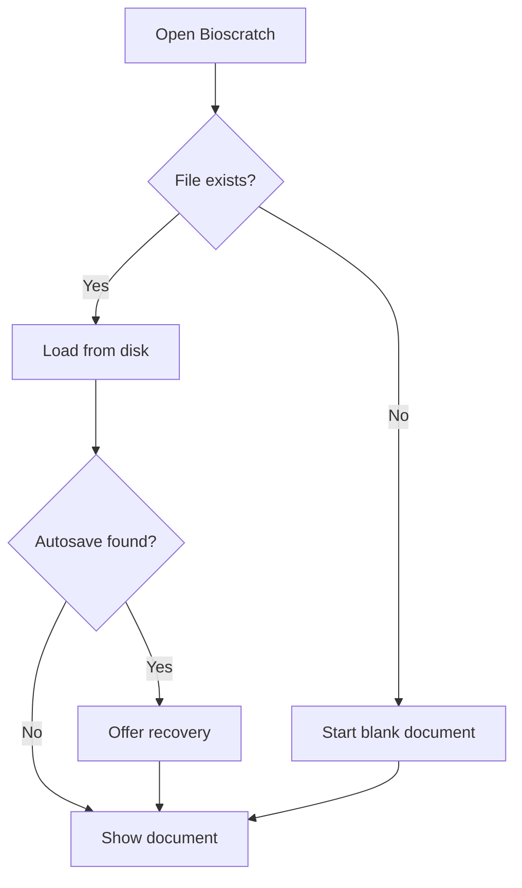
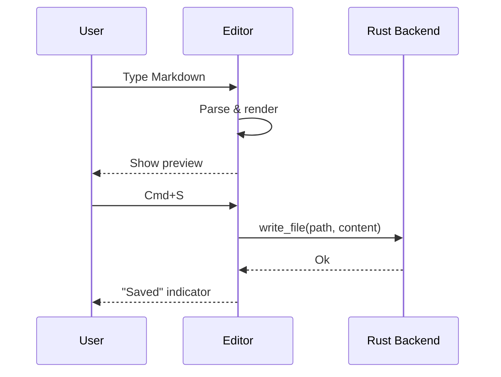
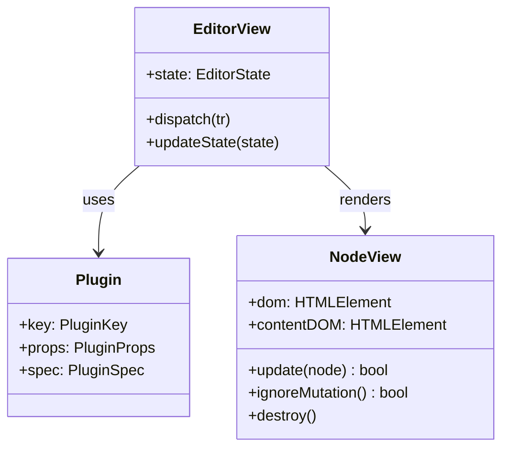
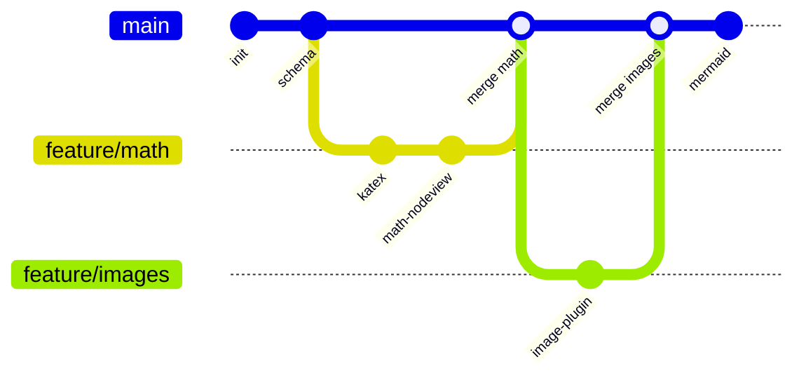
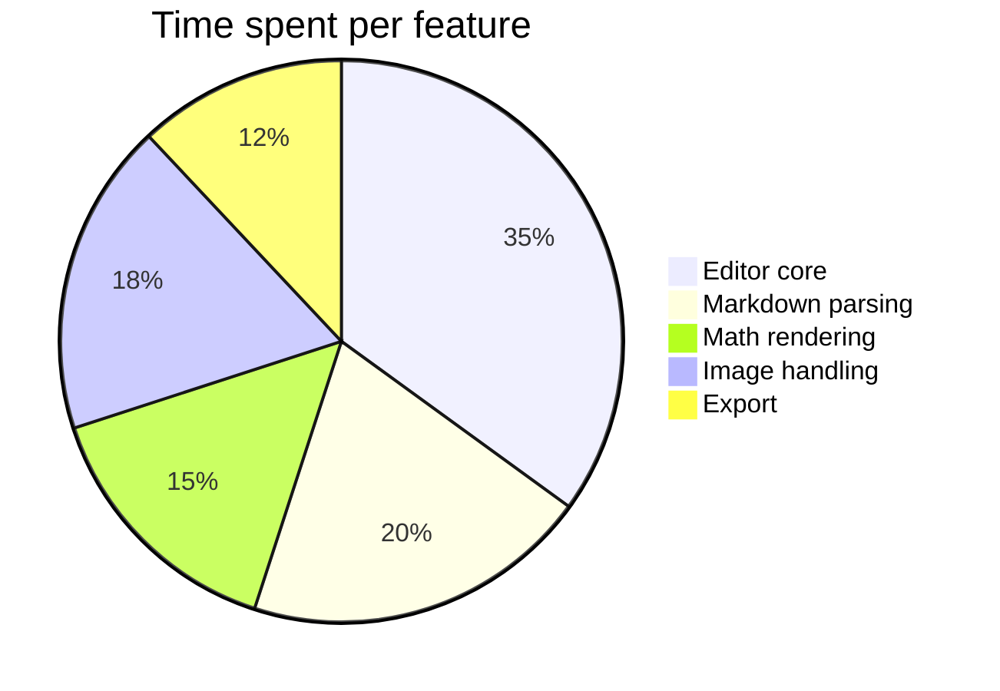
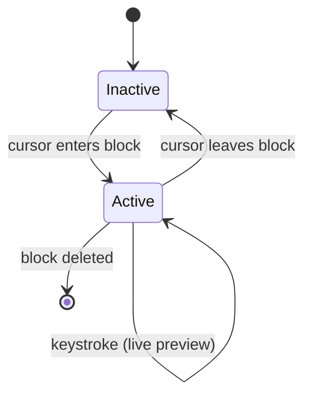
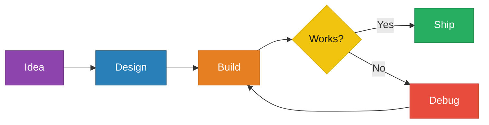

# Mermaid Diagrams

Click any diagram to reveal and edit the source. Changes re-render live.

## Flowchart

## Sequence Diagram

## Class Diagram

## Git Graph

## Pie Chart

## State Diagram

## Color Test — Explicit Node Colors

